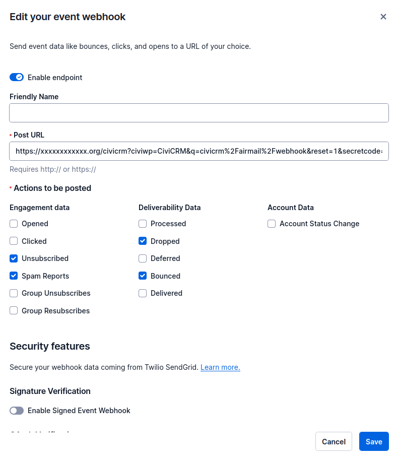

# SendGrid Specific Configuration

## Settings in SendGrid
Log in to SendGrid go to Settings -> Mail Settings -> Event Webhook (https://app.sendgrid.com/settings/mail_settings/webhook_settings) and configure the HTTP post URL to be the post URL and select the actions you would like reported back to your system we recommend:

- Mark as Span,
- Unsubscribed From,
- Dropped and
- Bounced

See Screenshot below:

## Settings in CiviCRM
For Opens and Clicks we recommend using the CiviCRM tracking (which is turned on by default) as using the SendGrid webhook for these has led to some bugs see this [issue in github](https://github.com/aghstrategies/com.aghstrategies.airmail/issues/56) for more details.

To Confirm that Open and Click Tracking is turned on in CiviCRM for your site login as an administrator, go to CiviCRM Admin Menu -> Administer -> CiviMail -> CiviMail Component Settings. Ensure the follow settings are checked:

>  Enable open tracking by default

>  Enable click-through tracking by default

Checking these boxes will set all future CiviMailings to default to having click-through tracking and open tracking enabled. You can overwrite these options on the settings for a specific mailing if you like.

Once Open and Click Tracking is turned on in CiviCRM for your site, you can choose to turn off sendgrid's tracking at https://app.sendgrid.com/settings/tracking as CiviCRM will be doing this.
